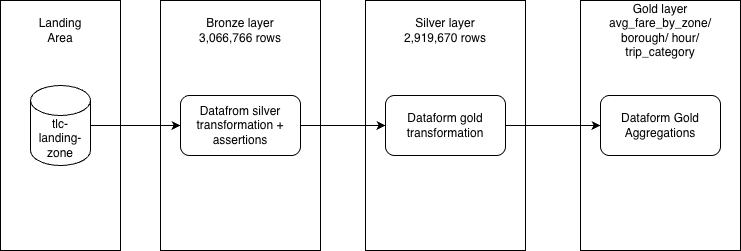

## Overview

An end-to-end data pipeline built on Google Cloud Platform using a medallion architecture. Raw NYC taxi trip data (3M+ records) is ingested into BigQuery, transformed and validated through Silver layer quality checks, and aggregated into Gold layer tables for analytics. Orchestrated via Apache Airflow running locally with Astro CLI.

## Tech Stack
- BigQuery — data warehouse (bronze, silver, gold datasets)
- Dataform (SQLx) — transformations and data quality assertions
- Apache Airflow (Astro CLI) — orchestration
- GCP IAM / Service Accounts — security

## Project Contents
This project contains the following files and folders:

- dags: This folder contains the Python files for your Airflow DAGs. By default, this directory includes one example DAG:
    - `nyc_taxi_pipeline`: This DAG replicates a pipeline using a medallion architecture where the is data is pulled from bronze layer and to silver layer while making sure it passes certain assertions needed to make sure that is cosumable and consitent further.
- Dockerfile: This file contains a versioned Astro Runtime Docker image that provides a differentiated Airflow experience. If you want to execute other commands or overrides at runtime, specify them here.
- include: This folder is gitignored as it contained sensitive file as service account key
- packages.txt: Install OS-level packages needed for your project by adding them to this file. It is empty by default.
- requirements.txt: Contains Python packages needed for project.
- plugins: Add custom or community plugins for your project to this file. It is empty by default.
- airflow_settings.yaml: Use this local-only file to specify Airflow Connections, Variables, and Pools instead of entering them in the Airflow UI as you develop DAGs in this project.

## Deploy Your Project Locally

Start Airflow on your local machine by running 'astro dev start'.

This command will spin up five Docker containers on your machine, each for a different Airflow component:

- Postgres: Airflow's Metadata Database
- Scheduler: The Airflow component responsible for monitoring and triggering tasks
- DAG Processor: The Airflow component responsible for parsing DAGs
- API Server: The Airflow component responsible for serving the Airflow UI and API
- Triggerer: The Airflow component responsible for triggering deferred tasks

When all five containers are ready the command will open the browser to the Airflow UI at http://localhost:8080/. You should also be able to access your Postgres Database at 'localhost:5432/postgres' with username 'postgres' and password 'postgres'.

## Data Info

### Layers

- bronze
- silver
- gold

### Row Count

- bronze: 3,066,766
- silver: 2,919,670
- gold: 20,667(avg_fares_by_zone)
        60 (avg_fare_by_borough)
        24 (avg_fare_by_hour)
        3  (avg_fare_by_trip_category)

### Freshness

The data was last updated on 17th June 2026.

### Architecture Diagram

